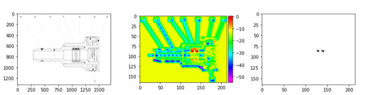

# Segmentation _Machine Learning_ algorithm with small dataset

## 1. Introduction

_Machine learning_ algorithm to locate o-ring component in engineering drawing using small dataset. O-ring component are modelised to increase dataset. Aim of this study is to evaluate the success of 3 different models and to assess the score fro each.

Segmentation algorithm with CNN (Convolutional neural network).

Project runs on _Google Colab_.

## 2. Problem of dataset

Dataset is created from parts of drawing with size 500x500px by adding modelling o-ring. With this, we can switch from 563 training data to more than 7,500.

## 3. Results

Example of input and output of model.

## 4. Files

* _mylib.ipynb_ contains all common functions used in oring_projet.ipynb
* _oring_projet.ipynb_ is the file with main function.
* _oring_optim.ipynb_  is the file to tune hyperparameters
